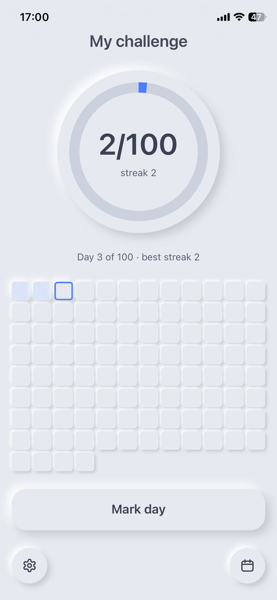
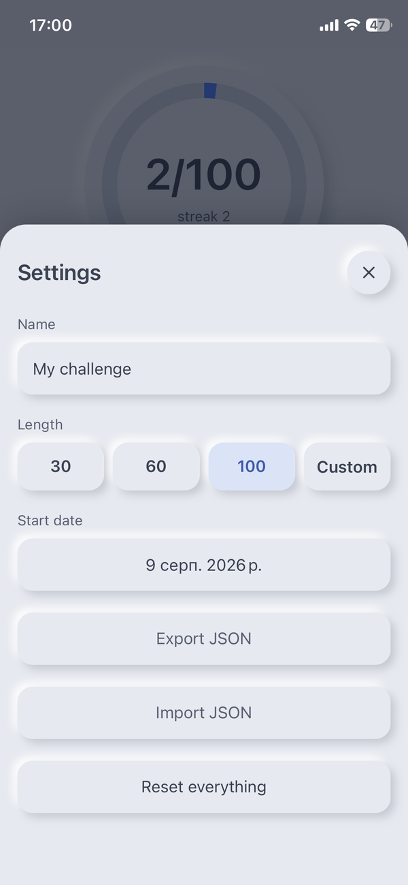

# Challenge Tracker

Built for one goal — track your success. No registration, no accounts, no data collection:
just you and your challenge.

**Live: https://slipmaks.github.io/challenge-tracker/** — open it on a phone, add it to the home
screen, and it works offline from then on.

| Main screen | Calendar | Settings |
|---|---|---|
|  |  |  |

## What it does

- Pick a name, a start date and a length — 30 / 60 / 100 days, or any number up to 365.
- One tap marks today done. Missed days can be fixed in the calendar; future days can't be
  marked at all, by construction.
- Progress ring, day counter, current and best streak — all computed from the data, never stored.
- Finish screen after the last day, with `Start over` reusing the same challenge.
- Export / import JSON — the only backup, and the only way to move to another phone.
- Installable PWA, fully offline.

## Why it exists

A pet project for learning Rust: small enough to actually finish, big enough to run into dates,
state, storage, WASM and a real build pipeline. One constraint shapes everything else —
**no backend**. All state is a single `localStorage` key, so there is nothing to host, nothing to
log into and nothing to leak.

## Stack

| | |
|---|---|
| Rust 2024 | under 1000 lines in three files |
| Leptos 0.8 (CSR) | signals only — no SSR, no router |
| Trunk 0.21 | bundles WASM + CSS into `docs/` |
| chrono | `NaiveDate` throughout, `Local::now()` in exactly one place |
| GitHub Pages | served from `/docs` on `master` — deploying is a commit |

No JS dependencies, no CSS framework, no web fonts. The whole visual layer is one hand-written
`style.css`.

## Run locally

```bash
rustup target add wasm32-unknown-unknown
cargo install trunk    # doesn't build everywhere — a release binary works, see architecture.md
trunk serve            # http://localhost:8080
cargo test             # 12 tests, pure logic from state.rs, runs natively
```

Release build — the same command that produces what Pages serves:

```bash
trunk build --release --dist docs --public-url /challenge-tracker/
```

## Layout

```
src/main.rs   App: composition and which bottom sheet is open
src/state.rs  Challenge — all logic, load/save, tests
src/ui.rs     Sheet, Ring, DayGrid, Calendar / Settings / Finish sheets
style.css     the entire palette and neomorphic relief
public/       manifest, service worker, icons — copied to the dist root
docs/         release build; this is what GitHub Pages serves
```

## Design and decisions

Both files were written before the code and are kept in sync with it — for a project you come
back to in a month they're the two most valuable files in the repo:

- [`architecture.md`](architecture.md) — stack choices, data model, build steps, how it's
  verified, and what's deliberately left out.
- [`design.md`](design.md) — the whole visual language: composition, bottom-sheet traps, day
  states, relief tiers, exact sizes taken from the mock.
- `challange-design.pen` — the mock, 7 screens (Pencil). When the prose and the mock disagree,
  the mock wins.

## Deliberately not doing

Push notifications (an alarm clock does the job without a server), cross-device sync (export the
JSON), several challenges at once, per-day exercise logs, dark theme. Each of those, with the
upgrade path, is listed at the end of `architecture.md`.
